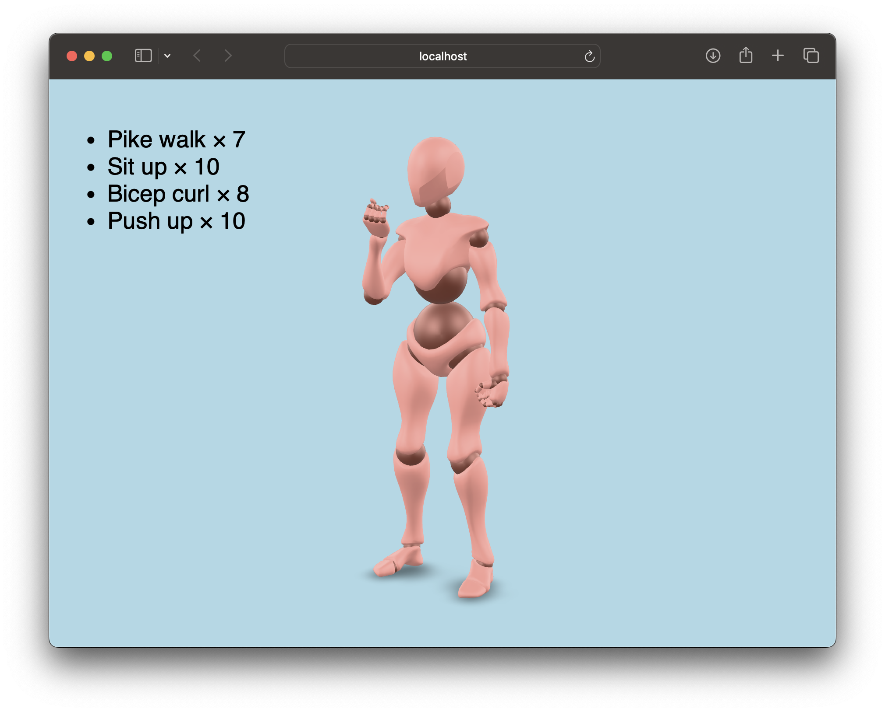

# Requirements

- Blender
- Python
- `<model-viewer>` compatible web browser

# Usage

```bash
python -m venv .venv
pip install -r requirements.txt
```

Optional: Edit the workout details near the top of `src/index.py`.

```bash
python src/index.py
python -m http.server
open http://localhost:8000/out/
```
